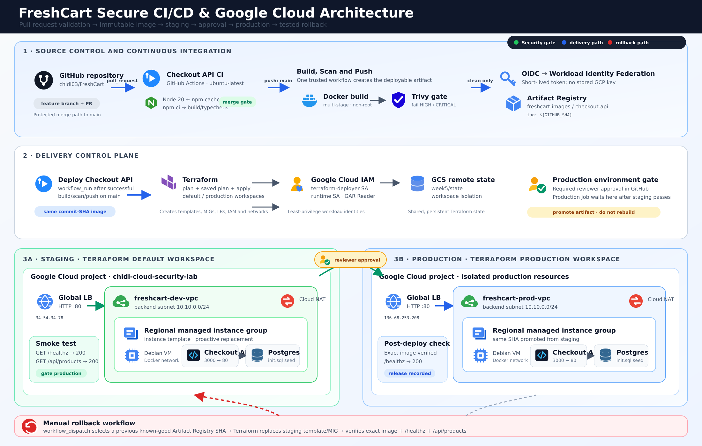

# FreshCart Week 6: Secure CI/CD Design Deliverable

## Repository and deployed environments

- Repository: <https://github.com/chidi03/FreshCart>
- Staging load balancer: <http://34.54.34.78>
- Production load balancer: <http://136.68.253.208>
- Artifact Registry image: `us-central1-docker.pkg.dev/chidi-cloud-security-lab/freshcart-images/checkout-api`
- Google Cloud project: `chidi-cloud-security-lab`
- Deployment region: `us-central1`

## Architecture diagram

The diagram is also supplied as an editable, scalable SVG: [`freshcart-cicd-architecture.svg`](freshcart-cicd-architecture.svg).

## Pipeline design

### Pull request validation

Pull requests targeting `main` trigger the **Checkout API CI** workflow. The job checks out the proposed commit, configures Node.js 20 with dependency caching, installs the lock-file-defined dependencies with `npm ci`, and runs the TypeScript build. A failed build or type check blocks the change before it reaches the release pipeline.

### Build, security scan, and publication

A merge to `main` triggers **Build, Scan and Push Checkout API**. The workflow builds the existing multi-stage Dockerfile and tags the image with the full Git commit SHA. Trivy scans the operating-system and application packages and returns a non-zero exit code when an unfixed HIGH or CRITICAL vulnerability is found. Only an image that passes this gate is authenticated and pushed to Google Artifact Registry.

GitHub Actions authenticates to Google Cloud through OpenID Connect and Workload Identity Federation. The workflow receives a short-lived Google access token instead of reading a long-lived service-account key from a repository secret. The publishing identity is separate from the Terraform deployment identity.

### Automatic staging deployment

The deployment workflow starts through `workflow_run` only after the build-and-scan workflow succeeds on `main`. It checks out the exact commit associated with the successful upstream run and constructs the same commit-SHA image URI. Terraform selects the default workspace, reads the remote state from GCS, plans the staging change, and applies the saved plan.

The staging smoke test checks both `/healthz` and `/api/products`. This is intentional: `/healthz` proves that the API can connect to PostgreSQL, while `/api/products` proves that a user-facing database-backed operation works. Production cannot start if either check fails.

### Approval-gated production promotion

The production job depends on the successful staging job and targets the protected GitHub `production` environment. GitHub pauses the job until a configured reviewer approves it. After approval, Terraform selects the `production` workspace and deploys the image URI returned by staging. No second Docker build occurs, so production receives the same tested artifact rather than a newly generated image with potentially different contents.

## Google Cloud runtime

Terraform provisions separate staging and production resources. Each environment contains a VPC, a backend subnet, Cloud NAT, firewall rules, an external HTTP load balancer, a health check, a regional managed instance group, and an instance template. The VM startup script installs Docker, authenticates to Artifact Registry with the VM's runtime service account, starts PostgreSQL with the FreshCart schema and seed script, and runs the checkout API container on port 3000 mapped to port 80.

Terraform uses a GCS backend for persistent state. The default and `production` workspaces isolate the resource states while keeping one reusable configuration. A dedicated runtime service account has Artifact Registry Reader access. The GitHub deployment service account has the permissions required to manage the Terraform-defined infrastructure.

## Traceability and immutable promotion

| Release event | Git commit and image tag | Result |
|---|---|---|
| Deliberately broken staging release | `186568e529a1b5fcacb8f6e12e00d6377505d40d` | `/healthz` returned 200 but `/api/products` returned 500; staging failed and production was skipped |
| Known-good rollback target | `a38aba717139881c3f0ce932829425b30aa9c820` | Restored to staging through the manual rollback workflow |
| Final repaired release | `1a78ac87ba7b695500a9b334d22b4ec5ac7c06f7` | Passed staging, reviewer approval, production deployment, and final checks |

The full commit SHA links a deployed container to one repository revision. The same value appears in the Git history, Artifact Registry tag, Terraform variable, instance-template startup script, workflow summary, and deployed-image output. This makes it possible to identify what is running and to redeploy a previous known-good version without guessing which mutable tag was used.

## Failure and rollback demonstration

The rollback exercise introduced a controlled fault in `/api/products`. The deliberately broken release still returned HTTP 200 from `/healthz`, but the functional endpoint returned HTTP 500 with `products_found: 15`. This proved that a shallow process-health check would have missed the application defect. The expanded staging smoke test caught the failure, returned exit code 1, and prevented the production job from running.

The manual rollback workflow was then dispatched with the known-good tag `a38aba717139881c3f0ce932829425b30aa9c820`. Terraform replaced the staging instance template and managed-instance-group VM. Temporary HTTP 503 responses appeared while the load balancer waited for the replacement backend. The verification eventually reported `health=200 products=200` and recorded that staging traffic had recovered.

During the first rollback attempt, `/api/products` exposed a separate infrastructure defect: the Terraform-created PostgreSQL container had not received `checkout-api/db/init.sql`, even though Docker Compose mounted it locally. The startup template was corrected to carry the SQL file as Base64 data, reconstruct it on the VM, and mount it at `/docker-entrypoint-initdb.d/init.sql`. This fix made newly created staging and production databases reproducible.

## Verified final state

- Staging image: `us-central1-docker.pkg.dev/chidi-cloud-security-lab/freshcart-images/checkout-api:1a78ac87ba7b695500a9b334d22b4ec5ac7c06f7`
- Production image: `us-central1-docker.pkg.dev/chidi-cloud-security-lab/freshcart-images/checkout-api:1a78ac87ba7b695500a9b334d22b4ec5ac7c06f7`
- Staging `/healthz`: HTTP 200 with `{"status":"ok"}`
- Staging `/api/products`: HTTP 200 with 15 seeded products
- Production `/healthz`: HTTP 200 with `{"status":"ok"}`
- Production `/api/products`: HTTP 200 with 15 seeded products

The identical image URIs confirm that production promoted the artifact tested in staging.

## Workflow evidence

| Evidence | File or URL |
|---|---|
| Pull request CI passed | [`evidence/01-pr-ci-passed.png`](evidence/01-pr-ci-passed.png) |
| Build, Trivy scan, and push passed | [`evidence/02-build-scan-push-passed.png`](evidence/02-build-scan-push-passed.png) |
| Commit-tagged image published | [`evidence/03-published-sha-image.png`](evidence/03-published-sha-image.png) |
| Production environment protection | [`evidence/04-production-environment-protection.png`](evidence/04-production-environment-protection.png) |
| Production approval gate | [`evidence/05-production-approval.png`](evidence/05-production-approval.png) |
| Controlled staging failure | [`evidence/06-staging-functional-failure.png`](evidence/06-staging-functional-failure.png) and [workflow run](https://github.com/chidi03/FreshCart/actions/runs/34797956007) |
| Successful rollback | [`evidence/07-rollback-recovered-traffic.png`](evidence/07-rollback-recovered-traffic.png) and [workflow run](https://github.com/chidi03/FreshCart/actions/runs/34798738127) |
| Final staging and production deployment | [`evidence/08-final-staging-production-success.png`](evidence/08-final-staging-production-success.png) and [workflow run](https://github.com/chidi03/FreshCart/actions/runs/34799964405) |

## Main implementation files

- `.github/workflows/ci.yml`
- `.github/workflows/build-scan.yml`
- `.github/workflows/deploy.yml`
- `.github/workflows/rollback.yml`
- `checkout-api/Dockerfile`
- `infrastructure/terraform/`
- `checkout-api/db/init.sql`
